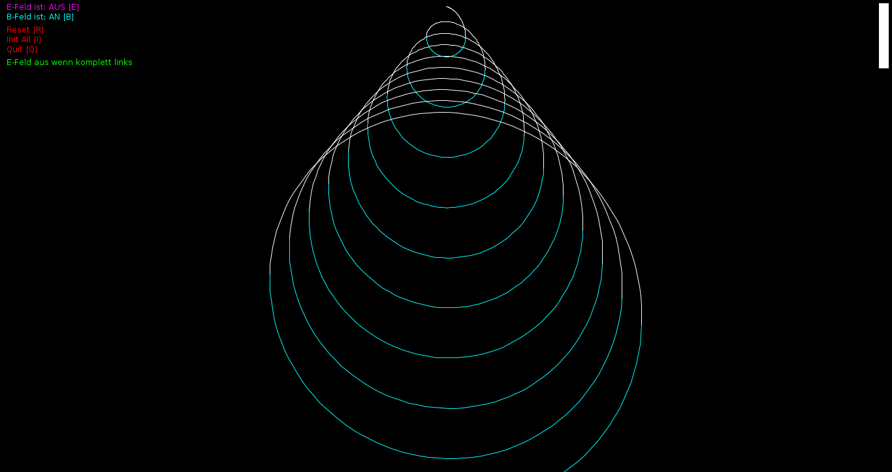
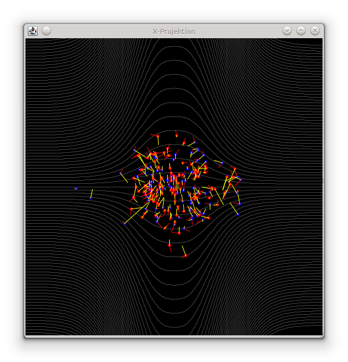
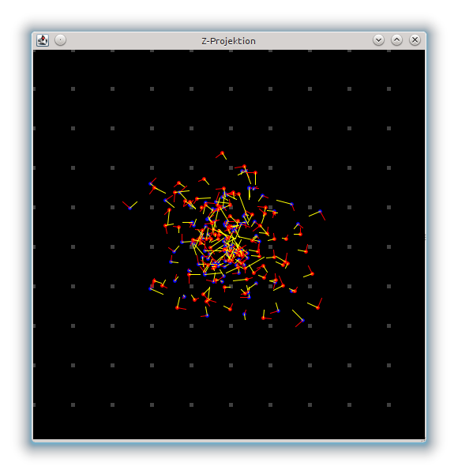
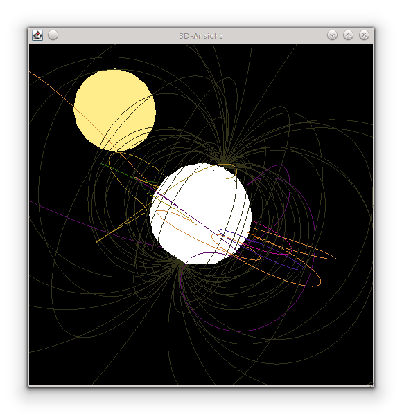
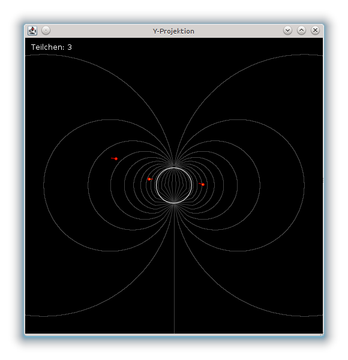
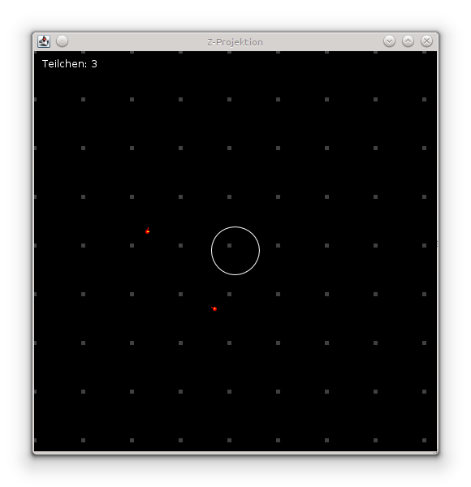

.. Copyright © 2012-2014, 2016-2017 Martin Ueding <dev@martin-ueding.de>

################
van-allen-sim-3d
################

Van Allen belt simulator.

Electric And Magnetic Fields
============================

When we covered magnetism in school, we had a problem which roughly said:

    “Given a charged particle is at rest in a constant magnetic field and one
    has an electric field that is switched on whenever the particle is on the
    right side, what kind of trajectory will it make?”

We figured that it will somewhat look like a cycloid, but the solution to the
problem set told us that it looks like what is pictured in the first image:

    Screenshot of the ebsimulator program. It shows the situation from the
    wording in the problem.

Since we thought we were right, but also thought that the solution would not be
too wrong, I wrote a little simulator which would just show the answer to the
problem empirically.

    Screenshot of the ebsimulator program. It shows the situation that was in
    picture of the problem.

In the program, you can manipulate the :math:`E` and :math:`B` fields with the
buttons ``e`` and ``b``. Pressing ``1`` will set the system to a mode where you
get the result from the sample solution, ``2`` will give you what the problem
says.

Magnetic Bottle
===============

Since I already had something to simulate charged particles, I wrote a little
simulation for a magnetic bottle since it was not obvious to me how that would
really work. You can see a curved magnetic field from three sides and also
their velocity and force vectors. That way, it becomes clearer why they usually
stay in the middle of the field.

    X-projection of the magnetic bottle

    Z-projection of the magnetic bottle

Van Allen Radiation Belt
========================

Once the magnetic bottle was implemented, I tried out Java 3D and got the
trajectories of charged particles in the magnetic field of the earth. The
simulation is not good enough to see the charged particles move along the
magnetic field lines, but they usually hit the earth on either pole, which is
the idea behind northern lights.

    3D panel of the Van Allen belt simulator

    Y panel of the Van Allen belt simulator

    Z panel of the Van Allen belt simulator

Download
========

I have written those three programs around 2009, so the source code is in
German, and it is not structured very well. The code is included in the
``.jar`` files.

- `<ebsimulator.jar>`_
- `<magneticbottle.jar>`_
- `<vanallensim3d.jar>`_

.. vim: spell
